Simulate Hybrids and Inbreeding
================
Norah Saarman
2025-09-06

  - [Day 1: Hardy-Weinberg Equilibrium and FIS
    Analysis](#day-1-hardy-weinberg-equilibrium-and-fis-analysis)
      - [Introduction](#introduction)
      - [Learning Goals](#learning-goals)
  - [Background](#background)
      - [The Hardy-Weinberg (HW)
        principle](#the-hardy-weinberg-hw-principle)
      - [Assumptions of the HW
        principle](#assumptions-of-the-hw-principle)
      - [The fixation index (FIS) and
        interpretation](#the-fixation-index-fis-and-interpretation)
      - [Part 1: Analyzing Genetic
        Datasets](#part-1-analyzing-genetic-datasets)
          - [Importing Data](#importing-data)
          - [Basic Statistics and FIS
            Calculation](#basic-statistics-and-fis-calculation)
          - [Plotting FIS per Locus](#plotting-fis-per-locus)
          - [Discussion Questions](#discussion-questions)
      - [Part 2: Interpretation Exercise for Day
        1](#part-2-interpretation-exercise-for-day-1)
      - [Self-Assessment Questions](#self-assessment-questions)
  - [Day 2: Simulating and Interpreting Signals of Hybridization from
    Population Genetics
    Data](#day-2-simulating-and-interpreting-signals-of-hybridization-from-population-genetics-data)
      - [Introduction](#introduction-1)
      - [Learning Goals](#learning-goals-1)
      - [Background](#background-1)
      - [Part 3: Simulating Genetic
        Data](#part-3-simulating-genetic-data)
          - [Simulating Inbreeding](#simulating-inbreeding)
      - [Analyzing Simulated Data - FIS Calculation and
        PCA](#analyzing-simulated-data---fis-calculation-and-pca)
          - [Interpretation Exercise](#interpretation-exercise)
  - [Day 3: Real-World Example - Pine Hybrid
    Zone](#day-3-real-world-example---pine-hybrid-zone)
      - [Importing VCF Data](#importing-vcf-data)
      - [Part 4: PCA Analysis with Real World
        Data](#part-4-pca-analysis-with-real-world-data)
          - [Create population codes and group codes for
            colloring](#create-population-codes-and-group-codes-for-colloring)
  - [Repeat with my best guess of what 17 pops are the hybrid cline
    populations.](#repeat-with-my-best-guess-of-what-17-pops-are-the-hybrid-cline-populations)
      - [References](#references)

# Day 1: Hardy-Weinberg Equilibrium and FIS Analysis

## Introduction

In this lab, we will explore the Hardy-Weinberg (HW) principle, estimate
fixation indices (FIS), and analyze genetic data to understand patterns
of heterozygosity and potential deviations from HW equilibrium. We will
focus on understanding the effects of hybridization, population
structure, and inbreeding.

## Learning Goals

  - Understand the HW principle, its assumptions, and its applications.
  - Test for HW equilibrium using real genetic datasets.
  - Estimate locus-by-locus FIS and interpret deviations from HW
    expectations.
  - Identify genetic signatures of hybridization, inbreeding, and
    population structure.

# Background

The HW principle states that allele frequencies in a population remain
constant across generations in the absence of evolutionary forces. The
fixation index (FIS) helps identify deviations from HW equilibrium.

## The Hardy-Weinberg (HW) principle

At Hardy-Weinberg equilibrium, (i) allele frequencies in a population
will remain constant indefinitely, and (ii) genotypic proportions occur
at Hardy-Weinberg proportions in the population as determined by the
“square law”.

What is the “square law”? Think of the Punnett Square you learned about
in introductory genetics. Consider a single locus with two alleles A1
and A2.

Let:  
p = frequency of A1 allele  
q = frequency of A2 allele

Three genotypes are thus possible: A1A1, A1A2, and A2A2.

Let:  
P = frequency of A1A1 homozygote  
H = frequency of A1A2 heterozygote  
Q = frequency of A2A2 homozygote

From the frequencies, we can estimate allele frequencies:  
p = P + ½ H  
q = Q + ½ H

These frequencies will sum to 1, since there are only 2 alleles
present:  
p + q = 1

The frequencies of the alleles have not changed, and the genotypic
proportions are determined by the “square law”. For two alleles,
genotypic proportions are given by expanding the term (p+q)^2.

## Assumptions of the HW principle

The reason the Hardy-Weinberg equilibrium is useful to us is that for
evolutionary change to occur in a population, it is necessary for one or
more specific assumptions to be violated. We can use information about
the way the population deviates from HW expectations to understand which
assumptions have been violated (and thus the relative importance of
different forces of evolutionary change). What are these assumptions?

1)  Generations are discrete (i.e. non-overlapping)
2)  The species is diploid
3)  Reproduction is sexual
4)  The gene being considered has 2 alleles
5)  Allele frequencies are the same in males and females
6)  Mating is random
7)  The population size is infinite (i.e. no genetic drift)
8)  There is no migration (gene flow)
9)  There is no mutation
10) There is no selection

## The fixation index (FIS) and interpretation

Since the Hardy-Weinberg principle predicts that no evolution will occur
unless one of the above assumptions is violated, it is often useful to
test if a population is in HW equilibrium and use information about the
way the population deviates from HW expectations to understand which
assumptions have been violated. In other words, deviations from HW
expectations can help to determine the relative importance of random
drift, migration, mutation, and natural selection in affecting the
frequency of genetic polymorphism in natural populations.

FIS (Nei, 1987) provides a simple way of summarizing in what direction
the frequency of genetic polymorphism in natural populations deviate
from HW equilibrium. FIS is based on a comparison of observed
heterozygosity (Hobs) and the HW expected heterozygosity (Hexp) given
the allele frequencies in the population:

FIS = 1 - (Hobs/Hexp)

**Negative FIS indicates a homozygote deficit and heterozygote excess.
Some of many potential causes of heterozygote excess include:**

  - Small population size, this is because allele frequencies are likely
    to differ between sexes just due to chance.
  - Negative assortative mating when reproduction occurs between
    individuals bearing phenotypes more dissimilar than by chance.
  - Heterozygote advantage, something that sometimes occurs in hybrid
    zones
  - Selection, this can occur in cases of balancing selection, but
    usually occurs in only a small proportion of the genome.
  - See the list of assumptions and let your mind run\!

**Positive FIS indicates a homozygote excess and heterozygote deficit.
Some of many potential causes of heterozygote deficit include:**

  - Inbreeding, this is because matings between close relatives are more
    likely to result in pairing even rare alleles in homozygote form.
  - Population structure, this is because of the “Wahlund effect”, where
    two or more subpopulations are in Hardy-Weinberg equilibrium but
    have different allele frequencies such that the overall
    heterozygosity is reduced compared to if the whole population was in
    equilibrium.
  - Selection, this can occur in cases of directional selection because
    alleles that have a selective advantage are more likely to be in
    homozygous than heterozygous form. Note that these alleles are also
    more likely to go to fixation unless there is clinal variation,
    frequency-dependence, or other processes that maintain both alleles.
  - Technical issues, for example miss-scoring of heterozygotes as
    homozygotes because of low next-gen sequencing read depth.
  - See the list of assumptions and think through the logical
    consequences\!

## Part 1: Analyzing Genetic Datasets

There are population-level data from four scenarios in the input file,
your goal is to perform several analyses on these datasets and identify
which dataset A-D matches scenarios 1-4.

Four Scenarios:  1) Marten dataset from the admixture zone in Idaho  
2\) Marten dataset from a healthy population north of the admixture
zone  
3\) Bull trout SNP dataset with very small Ne  
4\) Rainbow trout SNP dataset from a genome-wide association study 

### Importing Data

``` r
# Import data in genepop format
myData <- read.genepop("HW_FourScenarios.gen", ncode = 2, quiet = TRUE)

# Assign population labels (A-D)
pop_list <- as.factor(c(rep("A", 25), rep("B", 25), rep("C", 25), rep("D", 25)))
myData@pop <- pop_list
```

### Basic Statistics and FIS Calculation

``` r
# Calculate basic statistics for each scenario
statsA <- basic.stats(myData[myData@pop == "A"])
statsB <- basic.stats(myData[myData@pop == "B"])
statsC <- basic.stats(myData[myData@pop == "C"])
statsD <- basic.stats(myData[myData@pop == "D"])

# Display overall FIS for Scenario A
statsA$overall
```

    ##      Ho      Hs      Ht     Dst     Htp    Dstp     Fst    Fstp     Fis    Dest 
    ##  0.2396  0.1581  0.1581  0.0000     NaN     NaN  0.0000     NaN -0.5151     NaN

### Plotting FIS per Locus

``` r
# Plot FIS per locus for Scenario A
plot(statsA$perloc$Fis, main = "Scenario A", xlab = "Locus", ylab = "FIS")
abline(h = statsA$overall["Fis"], col = "red")
```

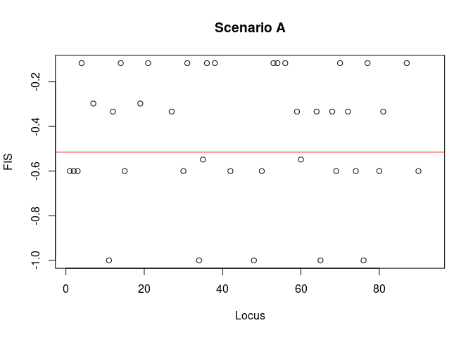<!-- -->

### Discussion Questions

1.  What trends do you observe in the basic statistics output?
2.  What are the overall expected heterozygosity, observed
    heterozygosity, and FIS?
3.  Are there loci with significant deviations from HW expectations?
4.  What biological processes might explain these patterns?

## Part 2: Interpretation Exercise for Day 1

After completing the analysis, write a short paragraph explaining
whether your dataset shows signs of:

  - **Inbreeding**: Indicated by a consistent heterozygote deficit
    (positive FIS).
  - **Population Structure (Wahlund Effect)**: Indicated by a high FIS
    due to subpopulation differences.
  - **Hybridization/Introgression**: Indicated by heterozygote excess or
    complex FIS patterns.

## Self-Assessment Questions

  - What did you learn about HW equilibrium in the context of
    hybridization?
  - How would you apply these concepts in conservation genetics?

# Day 2: Simulating and Interpreting Signals of Hybridization from Population Genetics Data

## Introduction

In this session, we will simulate genetic datasets to understand the
impacts of inbreeding, population structure, and hybridization on
genetic variation. This hands-on activity will reinforce concepts from
Day 1 and help differentiate between genetic signals in population data.

## Learning Goals

  - Simulate genetic datasets to explore the effects of inbreeding and
    population structure on HW equilibrium.
  - Distinguish between genetic signals of inbreeding, population
    structure (Wahlund effect), and hybridization.
  - Apply PCA to visualize population structure and interpret FIS values
    in simulated datasets.

## Background

Hybridization, inbreeding, and population structure can all produce
deviations from HW expectations. Simulating these scenarios allows us to
observe their unique genetic signatures and learn how to differentiate
them in real data.

## Part 3: Simulating Genetic Data

### Simulating Inbreeding

First, let’s simulate inbreeding:

``` r
# simulate inbreeding
iSim <- sim.genot(size=100,nbal=8,nbloc=15,nbpop=1,N=1000,mut=0.001,f=0.2) # simulate
colnames(iSim) <- NULL # replace column names with null to make adegenet happy
iData <- df2genind(iSim[-1], ncode=1) # convert to adegenet genind object
iData@pop <- as.factor(rep("Inbreeding",100)) # fill in "@pop" of genind object (for hierfstat)
```

Now, let’s simulate restricted gene flow (population structure):

``` r
# simulate population structure dataset
sSim <- sim.genot.metapop.t(size=50,nbal=8,nbloc=15,nbpop=2,N=50,
      mig=matrix(c(0.99,0.01,0.01,0.99),nrow=2,byrow=TRUE),f=0.01,mut=0.01,t=10000) # simulate
colnames(sSim) <- NULL # replace column names with null to make adegenet happy
sData <- df2genind(sSim[-1], ncode=1) # convert to adegenet genind object
sData@pop <- as.factor(rep("Structure",100)) # fill in "@pop" of genind object (for hierfstat)
```

What are the major parameter choices for the simulation of both
datasets? Is there anything you would change with less limited
computation time?  
newline

## Analyzing Simulated Data - FIS Calculation and PCA

Within yourgroup, use the R package “hierfstat” following the code below
to estimate and plot basic statistics including FIS, and visualize the
genetic structure present in the simulated datasets. Then answer the
following question (also listed in the Rmd file, feel free to type into
the Rmd save it for your records):

``` r
# basic stats
iStats <- basic.stats(iData)
iStats 
```

    ## $perloc
    ##         Ho     Hs     Ht Dst Htp Dstp Fst Fstp    Fis Dest
    ## loc01 0.51 0.7213 0.7213   0  NA   NA   0  NaN 0.2930   NA
    ## loc02 0.62 0.7710 0.7710   0 NaN  NaN   0  NaN 0.1959  NaN
    ## loc03 0.54 0.6480 0.6480   0  NA   NA   0  NaN 0.1667   NA
    ## loc04 0.40 0.5999 0.5999   0  NA   NA   0  NaN 0.3333   NA
    ## loc05 0.56 0.7149 0.7149   0  NA   NA   0  NaN 0.2167   NA
    ## loc06 0.68 0.8253 0.8253   0 NaN  NaN   0  NaN 0.1760  NaN
    ## loc07 0.72 0.7968 0.7968   0  NA   NA   0  NaN 0.0963   NA
    ## loc08 0.47 0.6155 0.6155   0  NA   NA   0  NaN 0.2363   NA
    ## loc09 0.51 0.6889 0.6889   0  NA   NA   0  NaN 0.2597   NA
    ## loc10 0.59 0.7546 0.7546   0 NaN  NaN   0  NaN 0.2182  NaN
    ## loc11 0.47 0.6188 0.6188   0 NaN  NaN   0  NaN 0.2405  NaN
    ## loc12 0.54 0.6821 0.6821   0 NaN  NaN   0  NaN 0.2084  NaN
    ## loc13 0.61 0.8048 0.8048   0 NaN  NaN   0  NaN 0.2421  NaN
    ## loc14 0.23 0.2625 0.2625   0 NaN  NaN   0  NaN 0.1237  NaN
    ## loc15 0.46 0.5880 0.5880   0 NaN  NaN   0  NaN 0.2177  NaN
    ## 
    ## $overall
    ##     Ho     Hs     Ht    Dst    Htp   Dstp    Fst   Fstp    Fis   Dest 
    ## 0.5273 0.6728 0.6728 0.0000    NaN    NaN 0.0000    NaN 0.2163    NaN

``` r
sStats <- basic.stats(sData)
sStats 
```

    ## $perloc
    ##         Ho     Hs     Ht Dst Htp Dstp Fst Fstp     Fis Dest
    ## loc01 0.73 0.7999 0.7999   0  NA   NA   0  NaN  0.0874   NA
    ## loc02 0.71 0.7577 0.7577   0  NA   NA   0  NaN  0.0629   NA
    ## loc03 0.59 0.6759 0.6759   0  NA   NA   0  NaN  0.1271   NA
    ## loc04 0.55 0.7527 0.7527   0  NA   NA   0  NaN  0.2693   NA
    ## loc05 0.65 0.7861 0.7861   0  NA   NA   0  NaN  0.1731   NA
    ## loc06 0.59 0.6606 0.6606   0 NaN  NaN   0  NaN  0.1069  NaN
    ## loc07 0.72 0.7755 0.7755   0 NaN  NaN   0  NaN  0.0715  NaN
    ## loc08 0.59 0.6621 0.6621   0 NaN  NaN   0  NaN  0.1089  NaN
    ## loc09 0.53 0.5524 0.5524   0 NaN  NaN   0  NaN  0.0406  NaN
    ## loc10 0.67 0.8434 0.8434   0  NA   NA   0  NaN  0.2056   NA
    ## loc11 0.70 0.6833 0.6833   0 NaN  NaN   0  NaN -0.0244  NaN
    ## loc12 0.60 0.6398 0.6398   0 NaN  NaN   0  NaN  0.0622  NaN
    ## loc13 0.57 0.6519 0.6519   0  NA   NA   0  NaN  0.1256   NA
    ## loc14 0.62 0.6856 0.6856   0  NA   NA   0  NaN  0.0957   NA
    ## loc15 0.69 0.7334 0.7334   0 NaN  NaN   0  NaN  0.0592  NaN
    ## 
    ## $overall
    ##     Ho     Hs     Ht    Dst    Htp   Dstp    Fst   Fstp    Fis   Dest 
    ## 0.6340 0.7107 0.7107 0.0000    NaN    NaN 0.0000    NaN 0.1079    NaN

``` r
# FIS plots 
plot(iStats$perloc$Fis,xlab = "locus", ylab = "Fis", main = "Inbreeding",ylim = c(-1,1))
abline(h=iStats$overall[9],col="red")
```

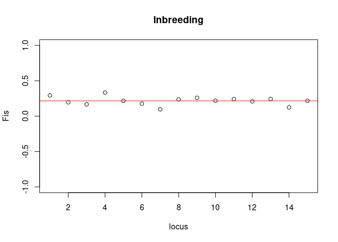<!-- -->

``` r
plot(sStats$perloc$Fis,xlab = "locus", ylab = "Fis", main = "Structure",ylim = c(-1,1))
abline(h=sStats$overall[9],col="red")
```

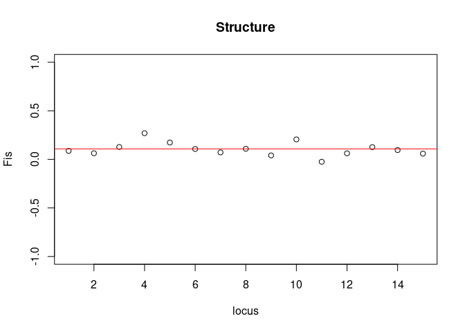<!-- -->

``` r
# PCA Analysis
iPCA <- dudi.pca(iData, cent=FALSE, scale=TRUE, scannf=FALSE, nf=4)
sPCA <- dudi.pca(sData, cent=FALSE, scale=TRUE, scannf=FALSE, nf=4)

# Plotting PCA
plot(iPCA$li[1:2], main="PCA of Inbreeding Simulation")
```

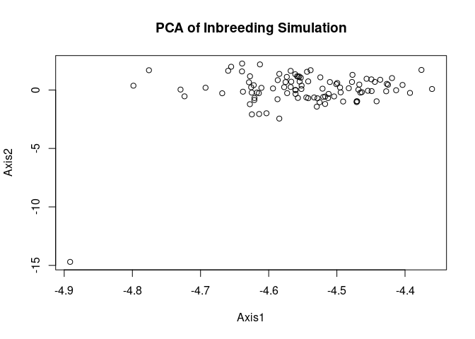<!-- -->

``` r
plot(sPCA$li[1:2], main="PCA of Structured Population Simulation")
```

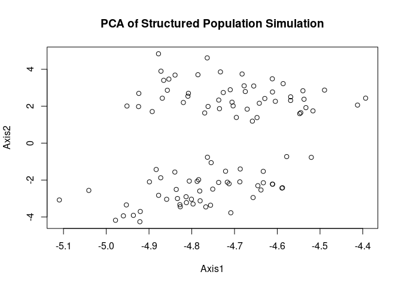<!-- -->

Do you think there is an overall heterozygote excess or defecit in these
two datasets?  
What do you think caused this excess deficit in each case? Are there any
obvious differences between the output for these different simulations?
What can we do to distinguish between the possible causes (population
structure and inbreeding)?

One idea for this is to run a principal component analysis on the
simulated genotypes and visualize (plot) the eigenvectors to see how the
individuals cluster…Is there any population structure?  
newline

First let’s plot the PCA eigenvalues and eigenvectors from the
simulation with inbreeding:

``` r
# PCA for simulation with inbreeding
iPCA <- dudi.pca(iData,cent=FALSE,scale=TRUE,scannf=FALSE,nf=4)
barplot(iPCA$eig[1:50],main="PCA eigenvalues", col=heat.colors(50)) # view eigenvalues
```

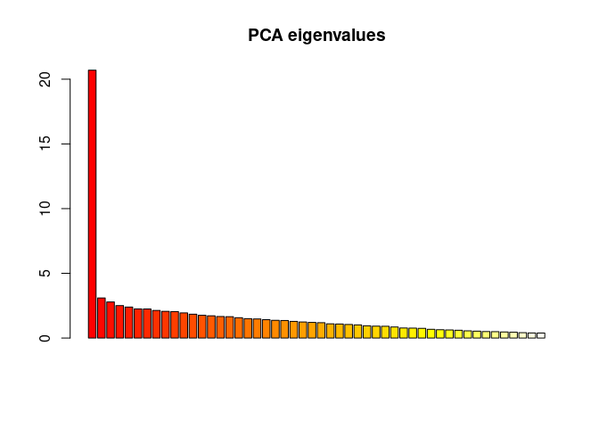<!-- -->

``` r
s.label(iPCA$li) # plot eigenvectors
```

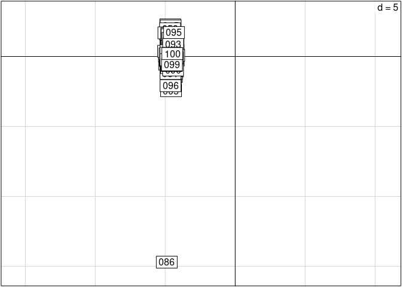<!-- -->

Now, let’s plot the PCA eigenvalues and eigenvectors from the simulation
with restricted gene flow:

``` r
# PCA for structured
sPCA <- dudi.pca(sData,cent=FALSE,scale=TRUE,scannf=FALSE,nf=4)
barplot(sPCA$eig[1:50],main="PCA eigenvalues", col=heat.colors(50)) # view eigenvalues
```

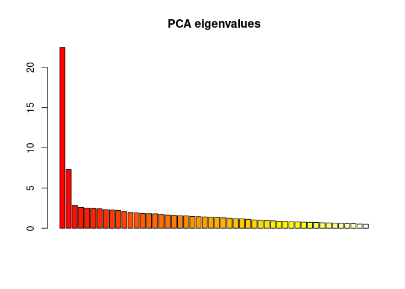<!-- -->

``` r
s.label(sPCA$li)
```

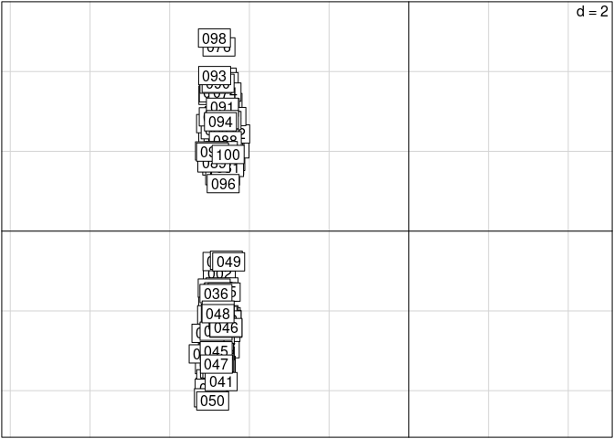<!-- -->

Do you see the population structure in the one dataset and not the
other? What other analysis would you want to do if this were your own
thesis to prove to yourself there is population structure rather than
inbreeding?  
newline

One idea here is to estimate FIS again after separating these putative
clusters. Does the signal of FIS go away?

``` r
grpA <- sData[sPCA$li$Axis2>0]
grpB <- sData[sPCA$li$Axis2<0]

# basic stats
aStats <- basic.stats(grpA)
aStats 
```

    ## $perloc
    ##         Ho     Hs     Ht Dst Htp Dstp Fst Fstp     Fis Dest
    ## loc01 0.70 0.6584 0.6584   0 NaN  NaN   0  NaN -0.0632  NaN
    ## loc02 0.72 0.7704 0.7704   0 NaN  NaN   0  NaN  0.0654  NaN
    ## loc03 0.66 0.7231 0.7231   0 NaN  NaN   0  NaN  0.0872  NaN
    ## loc04 0.56 0.6098 0.6098   0 NaN  NaN   0  NaN  0.0817  NaN
    ## loc05 0.52 0.5457 0.5457   0 NaN  NaN   0  NaN  0.0471  NaN
    ## loc06 0.60 0.5963 0.5963   0 NaN  NaN   0  NaN -0.0062  NaN
    ## loc07 0.62 0.6731 0.6731   0 NaN  NaN   0  NaN  0.0788  NaN
    ## loc08 0.56 0.6737 0.6737   0 NaN  NaN   0  NaN  0.1687  NaN
    ## loc09 0.70 0.6508 0.6508   0 NaN  NaN   0  NaN -0.0756  NaN
    ## loc10 0.74 0.7078 0.7078   0 NaN  NaN   0  NaN -0.0456  NaN
    ## loc11 0.70 0.6718 0.6718   0 NaN  NaN   0  NaN -0.0419  NaN
    ## loc12 0.56 0.5808 0.5808   0 NaN  NaN   0  NaN  0.0358  NaN
    ## loc13 0.40 0.4757 0.4757   0  NA   NA   0  NaN  0.1592   NA
    ## loc14 0.64 0.6835 0.6835   0 NaN  NaN   0  NaN  0.0636  NaN
    ## loc15 0.80 0.7612 0.7612   0 NaN  NaN   0  NaN -0.0509  NaN
    ## 
    ## $overall
    ##     Ho     Hs     Ht    Dst    Htp   Dstp    Fst   Fstp    Fis   Dest 
    ## 0.6320 0.6521 0.6521 0.0000    NaN    NaN 0.0000    NaN 0.0309    NaN

``` r
bStats <- basic.stats(grpB)
bStats 
```

    ## $perloc
    ##         Ho     Hs     Ht Dst Htp Dstp Fst Fstp     Fis Dest
    ## loc01 0.76 0.8249 0.8249   0 NaN  NaN   0  NaN  0.0787  NaN
    ## loc02 0.70 0.7227 0.7227   0  NA   NA   0  NaN  0.0313   NA
    ## loc03 0.52 0.5510 0.5510   0 NaN  NaN   0  NaN  0.0563  NaN
    ## loc04 0.54 0.6884 0.6884   0  NA   NA   0  NaN  0.2155   NA
    ## loc05 0.78 0.7873 0.7873   0 NaN  NaN   0  NaN  0.0093  NaN
    ## loc06 0.58 0.6439 0.6439   0 NaN  NaN   0  NaN  0.0992  NaN
    ## loc07 0.82 0.7547 0.7547   0 NaN  NaN   0  NaN -0.0865  NaN
    ## loc08 0.62 0.6431 0.6431   0  NA   NA   0  NaN  0.0359   NA
    ## loc09 0.36 0.3896 0.3896   0  NA   NA   0  NaN  0.0760   NA
    ## loc10 0.60 0.7855 0.7855   0 NaN  NaN   0  NaN  0.2362  NaN
    ## loc11 0.70 0.6467 0.6467   0  NA   NA   0  NaN -0.0824   NA
    ## loc12 0.64 0.6516 0.6516   0 NaN  NaN   0  NaN  0.0179  NaN
    ## loc13 0.74 0.7694 0.7694   0 NaN  NaN   0  NaN  0.0382  NaN
    ## loc14 0.60 0.6139 0.6139   0 NaN  NaN   0  NaN  0.0226  NaN
    ## loc15 0.58 0.5929 0.5929   0 NaN  NaN   0  NaN  0.0217  NaN
    ## 
    ## $overall
    ##     Ho     Hs     Ht    Dst    Htp   Dstp    Fst   Fstp    Fis   Dest 
    ## 0.6360 0.6710 0.6710 0.0000    NaN    NaN 0.0000    NaN 0.0522    NaN

``` r
# FIS plots 
plot(iStats$perloc$Fis,xlab = "locus", ylab = "Fis", main = "Inbreeding",ylim = c(-1,1))
abline(h=iStats$overall[9],col="red")
```

<!-- -->

``` r
plot(sStats$perloc$Fis,xlab = "locus", ylab = "Fis", main = "Structure",ylim = c(-1,1))
abline(h=sStats$overall[9],col="red")
```

<!-- -->

``` r
plot(aStats$perloc$Fis,xlab = "locus", ylab = "Fis", main = "Structured - A",ylim = c(-1,1))
abline(h=aStats$overall[9],col="red")
```

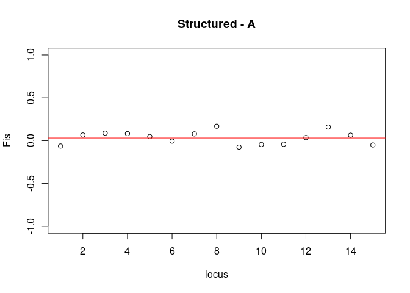<!-- -->

``` r
plot(bStats$perloc$Fis,xlab = "locus", ylab = "Fis", main = "Structured - B",ylim = c(-1,1))
abline(h=bStats$overall[9],col="red")
```

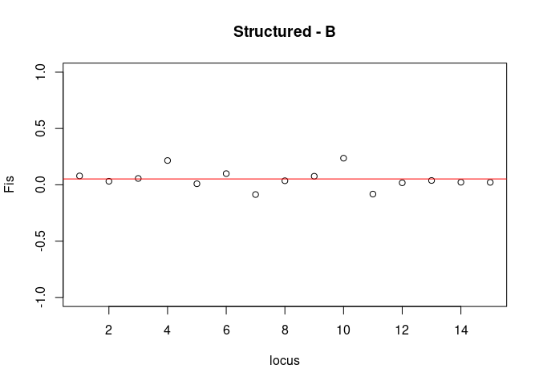<!-- -->

After separating the dataset into two clusters and estimating FIS again
for each putative cluster, does the signal of high FIS go away? Why/why
not?  
newline

To illustrate what would happen if the underlying cause really were FIS
not structured populations, we can run the same analysis with the
simulation with inbreeding:

``` r
grpC <- iData[iPCA$li$Axis2>0]
grpD <- iData[iPCA$li$Axis2<0]

# basic stats
cStats <- basic.stats(grpC)
cStats 
```

    ## $perloc
    ##           Ho     Hs     Ht Dst Htp Dstp Fst Fstp    Fis Dest
    ## loc01 0.5179 0.7295 0.7295   0  NA   NA   0  NaN 0.2902   NA
    ## loc02 0.6429 0.7614 0.7614   0  NA   NA   0  NaN 0.1557   NA
    ## loc03 0.5000 0.6326 0.6326   0 NaN  NaN   0  NaN 0.2096  NaN
    ## loc04 0.4286 0.5958 0.5958   0  NA   NA   0  NaN 0.2807   NA
    ## loc05 0.5714 0.7557 0.7557   0  NA   NA   0  NaN 0.2438   NA
    ## loc06 0.6607 0.8226 0.8226   0  NA   NA   0  NaN 0.1968   NA
    ## loc07 0.6786 0.7497 0.7497   0  NA   NA   0  NaN 0.0948   NA
    ## loc08 0.4464 0.5795 0.5795   0  NA   NA   0  NaN 0.2297   NA
    ## loc09 0.5000 0.6068 0.6068   0 NaN  NaN   0  NaN 0.1760  NaN
    ## loc10 0.5357 0.7455 0.7455   0 NaN  NaN   0  NaN 0.2814  NaN
    ## loc11 0.4821 0.6174 0.6174   0 NaN  NaN   0  NaN 0.2190  NaN
    ## loc12 0.6429 0.6953 0.6953   0 NaN  NaN   0  NaN 0.0754  NaN
    ## loc13 0.6071 0.8045 0.8045   0  NA   NA   0  NaN 0.2454   NA
    ## loc14 0.2321 0.2737 0.2737   0  NA   NA   0  NaN 0.1518   NA
    ## loc15 0.4821 0.4834 0.4834   0  NA   NA   0  NaN 0.0027   NA
    ## 
    ## $overall
    ##     Ho     Hs     Ht    Dst    Htp   Dstp    Fst   Fstp    Fis   Dest 
    ## 0.5286 0.6569 0.6569 0.0000    NaN    NaN 0.0000    NaN 0.1953    NaN

``` r
dStats <- basic.stats(grpD)
dStats 
```

    ## $perloc
    ##           Ho     Hs     Ht Dst Htp Dstp Fst Fstp    Fis Dest
    ## loc01 0.5000 0.6927 0.6927   0  NA   NA   0  NaN 0.2781   NA
    ## loc02 0.5909 0.7873 0.7873   0 NaN  NaN   0  NaN 0.2494  NaN
    ## loc03 0.5909 0.6607 0.6607   0 NaN  NaN   0  NaN 0.1056  NaN
    ## loc04 0.3636 0.5999 0.5999   0 NaN  NaN   0  NaN 0.3938  NaN
    ## loc05 0.5455 0.6549 0.6549   0 NaN  NaN   0  NaN 0.1671  NaN
    ## loc06 0.7045 0.7999 0.7999   0 NaN  NaN   0  NaN 0.1193  NaN
    ## loc07 0.7727 0.8282 0.8282   0 NaN  NaN   0  NaN 0.0670  NaN
    ## loc08 0.5000 0.6485 0.6485   0 NaN  NaN   0  NaN 0.2290  NaN
    ## loc09 0.5227 0.7743 0.7743   0 NaN  NaN   0  NaN 0.3249  NaN
    ## loc10 0.6591 0.7569 0.7569   0 NaN  NaN   0  NaN 0.1292  NaN
    ## loc11 0.4545 0.6152 0.6152   0 NaN  NaN   0  NaN 0.2612  NaN
    ## loc12 0.4091 0.5579 0.5579   0 NaN  NaN   0  NaN 0.2667  NaN
    ## loc13 0.6136 0.7791 0.7791   0  NA   NA   0  NaN 0.2123   NA
    ## loc14 0.2273 0.2460 0.2460   0 NaN  NaN   0  NaN 0.0763  NaN
    ## loc15 0.4318 0.6416 0.6416   0 NaN  NaN   0  NaN 0.3270  NaN
    ## 
    ## $overall
    ##     Ho     Hs     Ht    Dst    Htp   Dstp    Fst   Fstp    Fis   Dest 
    ## 0.5258 0.6695 0.6695 0.0000    NaN    NaN 0.0000    NaN 0.2147    NaN

``` r
# FIS plots 
plot(cStats$perloc$Fis,xlab = "locus", ylab = "Fis", main = "Inbreeding - C")
abline(h=cStats$overall[9],col="red")
```

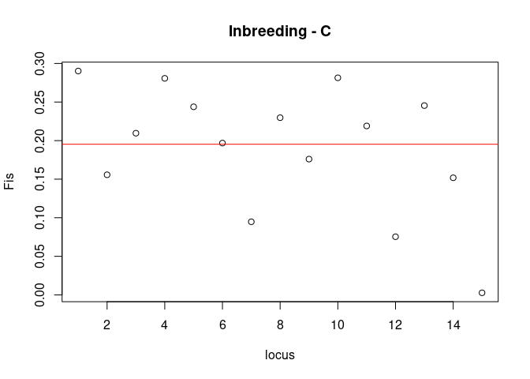<!-- -->

``` r
plot(dStats$perloc$Fis,xlab = "locus", ylab = "Fis", main = "Inbreeding - D")
abline(h=dStats$overall[9],col="red")
```

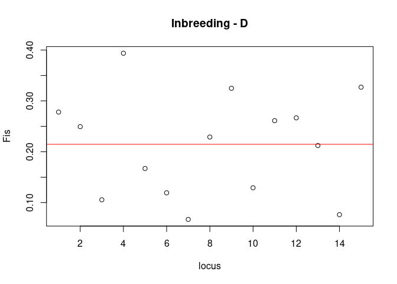<!-- -->

This time, after separating the dataset artificially into two clusters
and estimating FIS again for each putative cluster, does the signal of
high FIS go away? Why/why not?  
newline

Can you imagine a scenario where it may be difficult to distinguish the
cause of a high value of FIS? What might this be?  
newline

### Interpretation Exercise

Write a paragraph explaining whether your simulated dataset shows signs
of:

  - **Inbreeding**: High FIS with no clear population structure in PCA.
  - **Population Structure**: High FIS with clear clusters in PCA.
  - **Hybridization**: Patterns that reflect both heterozygote excess
    and mixed ancestry.

# Day 3: Real-World Example - Pine Hybrid Zone

### Importing VCF Data

The first step is to subsample just 5000 snps from the full dataset
available on Dryad. I will perform and provide this file, but for your
information:

**Example: Subsampling SNPs Using VCFtools**

For demonstration purposes, here’s an example of how to subsample SNPs
from a large VCF file using **vcftools**. This code is **not meant to be
run within R**, but serves as a reference for working with large
datasets.

``` bash
bash
module load vcftools
# Step 1: Filter the original VCF to retain only high-quality SNPs, then randomly select 5000 positions.
vcftools --gzvcf /uufs/chpc.utah.edu/common/home/saarman-group1/pine/diploid_Pydts_final.vcf.gz \
        # Keep only variants with a maximum of 2 alleles (biallelic sites)
         --max-alleles 2 \  
        # Ensure variants have at least 2 alleles (i.e., they are not monomorphic)
         --min-alleles 2 \
        # Retain only sites with no missing genotypes
         --max-missing 1.0 \      
        # Exclude indels so that only SNPs remain
         --remove-indels \
        # Apply a minor allele frequency filter; retain SNPs with MAF >= 5%
         --maf 0.01 \ 
        # Recode (write out) a new VCF file that includes only the filtered sites
         --recode \ 
        # Include all INFO fields from the original VCF in the output
         --recode-INFO-all \    
        # Output the recoded VCF to standard output for further processing
         --stdout | \  
        # Remove VCF header lines (lines starting with "#") 
         grep -v "^#" | \         
        # Randomly select 5000 SNP records
         shuf -n 5000 | \
        # Extract the first two columns and save to a file
         cut -f1,2 > random_snps.txt        

# Step 2: Use the list of positions to create a new VCF containing only these 5000 SNPs.
vcftools --gzvcf /uufs/chpc.utah.edu/common/home/saarman-group1/pine/diploid_Pydts_final.vcf.gz \
        # Use the list of SNP positions from the first step
         --positions random_snps.txt \  
         # Recode (filter) the VCF to include only these positions
         --recode \    
         # Retain all the INFO fields from the original VCF
         --recode-INFO-all \ 
        # Write the output to a file with prefix 'pine_random_subset'
         --out pine_random_subset        
```

*Note:* The output VCF (`pine_random_subset.recode.vcf`) will be
provided to students for analysis.

## Part 4: PCA Analysis with Real World Data

``` r
# Import from file
vcf <- read.vcfR("pine_random_subset.recode.vcf")
```

    ## Scanning file to determine attributes.
    ## File attributes:
    ##   meta lines: 55873
    ##   header_line: 55874
    ##   variant count: 5000
    ##   column count: 277
    ## Meta line 1000 read in.Meta line 2000 read in.Meta line 3000 read in.Meta line 4000 read in.Meta line 5000 read in.Meta line 6000 read in.Meta line 7000 read in.Meta line 8000 read in.Meta line 9000 read in.Meta line 10000 read in.Meta line 11000 read in.Meta line 12000 read in.Meta line 13000 read in.Meta line 14000 read in.Meta line 15000 read in.Meta line 16000 read in.Meta line 17000 read in.Meta line 18000 read in.Meta line 19000 read in.Meta line 20000 read in.Meta line 21000 read in.Meta line 22000 read in.Meta line 23000 read in.Meta line 24000 read in.Meta line 25000 read in.Meta line 26000 read in.Meta line 27000 read in.Meta line 28000 read in.Meta line 29000 read in.Meta line 30000 read in.Meta line 31000 read in.Meta line 32000 read in.Meta line 33000 read in.Meta line 34000 read in.Meta line 35000 read in.Meta line 36000 read in.Meta line 37000 read in.Meta line 38000 read in.Meta line 39000 read in.Meta line 40000 read in.Meta line 41000 read in.Meta line 42000 read in.Meta line 43000 read in.Meta line 44000 read in.Meta line 45000 read in.Meta line 46000 read in.Meta line 47000 read in.Meta line 48000 read in.Meta line 49000 read in.Meta line 50000 read in.Meta line 51000 read in.Meta line 52000 read in.Meta line 53000 read in.Meta line 54000 read in.Meta line 55000 read in.Meta line 55873 read in.
    ## All meta lines processed.
    ## gt matrix initialized.
    ## Character matrix gt created.
    ##   Character matrix gt rows: 5000
    ##   Character matrix gt cols: 277
    ##   skip: 0
    ##   nrows: 5000
    ##   row_num: 0
    ## Processed variant 1000Processed variant 2000Processed variant 3000Processed variant 4000Processed variant 5000Processed variant: 5000
    ## All variants processed

``` r
# Convert the VCF object to a genind object
genind_obj <- vcfR2genind(vcf)

# Extract population labels:
# - regexpr("^[A-Za-z]+", ...) finds the match of one or more letters at the beginning of each individual name.
# - regmatches() extracts that matching substring.
pop_labels <- regmatches(indNames(genind_obj), regexpr("^[^-_]+", indNames(genind_obj)))

#replace Ps01-Ps08 with Ps
pop_labels <- gsub("^Ps\\d+", "Ps", pop_labels)

# Assign the extracted labels as pop names
pop(genind_obj) <- pop_labels

# Display general information about the genind object
levels(genind_obj@pop)
```

    ##  [1] "BCPy03"  "BSPy02"  "BXPd01"  "CYPd04"  "CYPd05"  "CYPd06"  "CYPd07" 
    ##  [8] "CYPd08"  "DQPd02"  "GSPd03"  "GSPy04"  "GYPt01"  "JLPy02"  "KDPd02" 
    ## [15] "LJPy02"  "LTPd01"  "LXPd05"  "LXPd07"  "MKPd04"  "MYPd01"  "MZPd02" 
    ## [22] "NYPd10"  "PLPd04"  "PLPd05"  "PLPd06"  "Ps"      "TCPy01"  "TMTPt01"
    ## [29] "WSPy01"  "WXPy01"  "XCPd03"  "YLPd04"  "ZDPy06"  "ZDPy07"  "ZXPd02" 
    ## [36] "ZXPd03"  "ZXPd04"

``` r
indNames(genind_obj)
```

    ##   [1] "BCPy03-01"  "BCPy03-02"  "BCPy03-03"  "BCPy03-04"  "BCPy03-05" 
    ##   [6] "BCPy03-06"  "BCPy03-07"  "BCPy03-08"  "BSPy02-01"  "BSPy02-02" 
    ##  [11] "BSPy02-03"  "BSPy02-04"  "BSPy02-05"  "BSPy02-06"  "BSPy02-07" 
    ##  [16] "BSPy02-08"  "BXPd01_01"  "BXPd01_02"  "BXPd01_03"  "BXPd01_04" 
    ##  [21] "BXPd01_05"  "BXPd01_06"  "BXPd01_07"  "BXPd01_08"  "CYPd04_01" 
    ##  [26] "CYPd04_02"  "CYPd04_03"  "CYPd04_04"  "CYPd04_05"  "CYPd04_06" 
    ##  [31] "CYPd04_07"  "CYPd04_08"  "CYPd05_01"  "CYPd05_02"  "CYPd05_03" 
    ##  [36] "CYPd05_04"  "CYPd05_05"  "CYPd05_06"  "CYPd05_07"  "CYPd05_08" 
    ##  [41] "CYPd06_01"  "CYPd06_02"  "CYPd06_03"  "CYPd06_04"  "CYPd06_05" 
    ##  [46] "CYPd06_06"  "CYPd06_07"  "CYPd06_08"  "CYPd07_01"  "CYPd07_02" 
    ##  [51] "CYPd07_03"  "CYPd07_04"  "CYPd07_05"  "CYPd07_06"  "CYPd07_07" 
    ##  [56] "CYPd07_08"  "CYPd08_01"  "CYPd08_02"  "CYPd08_03"  "CYPd08_04" 
    ##  [61] "CYPd08_05"  "CYPd08_06"  "CYPd08_07"  "CYPd08_08"  "DQPd02_01" 
    ##  [66] "DQPd02_02"  "DQPd02_03"  "DQPd02_04"  "DQPd02_05"  "DQPd02_06" 
    ##  [71] "DQPd02_07"  "DQPd02_08"  "GSPd03_01"  "GSPd03_02"  "GSPd03_03" 
    ##  [76] "GSPd03_04"  "GSPd03_05"  "GSPd03_06"  "GSPd03_07"  "GSPd03_08" 
    ##  [81] "GSPy04-01"  "GSPy04-02"  "GSPy04-03"  "GSPy04-04"  "GSPy04-05" 
    ##  [86] "GSPy04-06"  "GSPy04-07"  "GSPy04-08"  "GYPt01_01"  "GYPt01_02" 
    ##  [91] "GYPt01_03"  "GYPt01_04"  "JLPy02_01"  "JLPy02_02"  "JLPy02_03" 
    ##  [96] "JLPy02_04"  "KDPd02_01"  "KDPd02_02"  "KDPd02_03"  "KDPd02_04" 
    ## [101] "KDPd02_05"  "KDPd02_06"  "KDPd02_07"  "KDPd02_08"  "LJPy02-01" 
    ## [106] "LJPy02-02"  "LJPy02-03"  "LJPy02-04"  "LJPy02-05"  "LJPy02-06" 
    ## [111] "LJPy02-07"  "LJPy02-08"  "LTPd01_01"  "LTPd01_02"  "LTPd01_03" 
    ## [116] "LTPd01_04"  "LTPd01_05"  "LTPd01_06"  "LTPd01_07"  "LTPd01_08" 
    ## [121] "LXPd05_01"  "LXPd05_02"  "LXPd05_03"  "LXPd05_04"  "LXPd05_05" 
    ## [126] "LXPd05_06"  "LXPd05_07"  "LXPd05_08"  "LXPd07_01"  "LXPd07_02" 
    ## [131] "LXPd07_03"  "LXPd07_04"  "LXPd07_05"  "LXPd07_06"  "LXPd07_07" 
    ## [136] "LXPd07_08"  "MKPd04_01"  "MKPd04_02"  "MKPd04_03"  "MKPd04_04" 
    ## [141] "MKPd04_05"  "MKPd04_06"  "MKPd04_07"  "MKPd04_08"  "MYPd01_01" 
    ## [146] "MYPd01_02"  "MYPd01_03"  "MYPd01_04"  "MYPd01_05"  "MYPd01_06" 
    ## [151] "MYPd01_07"  "MYPd01_08"  "MZPd02_01"  "MZPd02_02"  "MZPd02_03" 
    ## [156] "MZPd02_04"  "MZPd02_05"  "MZPd02_06"  "MZPd02_07"  "MZPd02_08" 
    ## [161] "NYPd10_01"  "NYPd10_02"  "NYPd10_03"  "NYPd10_04"  "NYPd10_05" 
    ## [166] "NYPd10_06"  "NYPd10_07"  "NYPd10_08"  "PLPd04_01"  "PLPd04_02" 
    ## [171] "PLPd04_03"  "PLPd04_04"  "PLPd05_01"  "PLPd05_02"  "PLPd05_03" 
    ## [176] "PLPd05_04"  "PLPd06_01"  "PLPd06_02"  "PLPd06_03"  "PLPd06_04" 
    ## [181] "PLPd06_05"  "PLPd06_06"  "PLPd06_07"  "PLPd06_08"  "Ps01"      
    ## [186] "Ps02"       "Ps03"       "Ps04"       "Ps05"       "Ps06"      
    ## [191] "Ps07"       "Ps08"       "TCPy01-01"  "TCPy01-02"  "TCPy01-03" 
    ## [196] "TCPy01-04"  "TCPy01_01"  "TCPy01_02"  "TCPy01_03"  "TCPy01_04" 
    ## [201] "TMTPt01_01" "TMTPt01_02" "TMTPt01_03" "TMTPt01_04" "WSPy01_01" 
    ## [206] "WSPy01_02"  "WSPy01_03"  "WSPy01_04"  "WXPy01-01"  "WXPy01-02" 
    ## [211] "WXPy01-03"  "WXPy01-04"  "WXPy01_01"  "WXPy01_02"  "WXPy01_03" 
    ## [216] "WXPy01_04"  "XCPd03_01"  "XCPd03_02"  "XCPd03_03"  "XCPd03_04" 
    ## [221] "XCPd03_05"  "XCPd03_06"  "XCPd03_07"  "XCPd03_08"  "YLPd04_01" 
    ## [226] "YLPd04_02"  "YLPd04_03"  "YLPd04_04"  "YLPd04_05"  "YLPd04_06" 
    ## [231] "YLPd04_07"  "YLPd04_08"  "ZDPy06-01"  "ZDPy06-02"  "ZDPy06-03" 
    ## [236] "ZDPy06-04"  "ZDPy06_01"  "ZDPy06_02"  "ZDPy06_03"  "ZDPy06_04" 
    ## [241] "ZDPy07-01"  "ZDPy07-02"  "ZDPy07-03"  "ZDPy07-04"  "ZDPy07-05" 
    ## [246] "ZDPy07-06"  "ZDPy07-07"  "ZDPy07-08"  "ZXPd02_01"  "ZXPd02_02" 
    ## [251] "ZXPd02_03"  "ZXPd02_04"  "ZXPd03_01"  "ZXPd03_02"  "ZXPd03_03" 
    ## [256] "ZXPd03_04"  "ZXPd03_05"  "ZXPd03_06"  "ZXPd03_07"  "ZXPd03_08" 
    ## [261] "ZXPd04_01"  "ZXPd04_02"  "ZXPd04_03"  "ZXPd04_04"  "ZXPd04_05" 
    ## [266] "ZXPd04_06"  "ZXPd04_07"  "ZXPd04_08"

``` r
table(pop_labels)
```

    ## pop_labels
    ##  BCPy03  BSPy02  BXPd01  CYPd04  CYPd05  CYPd06  CYPd07  CYPd08  DQPd02  GSPd03 
    ##       8       8       8       8       8       8       8       8       8       8 
    ##  GSPy04  GYPt01  JLPy02  KDPd02  LJPy02  LTPd01  LXPd05  LXPd07  MKPd04  MYPd01 
    ##       8       4       4       8       8       8       8       8       8       8 
    ##  MZPd02  NYPd10  PLPd04  PLPd05  PLPd06      Ps  TCPy01 TMTPt01  WSPy01  WXPy01 
    ##       8       8       4       4       8       8       8       4       4       8 
    ##  XCPd03  YLPd04  ZDPy06  ZDPy07  ZXPd02  ZXPd03  ZXPd04 
    ##       8       8       8       8       4       8       8

### Create population codes and group codes for colloring

``` r
# Load the scatterplot3d package
library(scatterplot3d)
```

    ## Warning: package 'scatterplot3d' was built under R version 4.0.5

``` r
genind_noPs <- genind_obj[genind_obj@pop != "Ps",] 

# Extract pop_codes
pop_codes <- as.character(pop(genind_noPs))

# Assign groups "Py", "Ps", "Pt", or "Pd"
pop_group <- ifelse(grepl("Py", pop_codes), "Py",
               ifelse(grepl("Pt", pop_codes), "Pt",
               ifelse(grepl("Pd", pop_codes), "Pd", "Other")))

pop_codes[pop_group == "Py"]
```

    ##  [1] "BCPy03" "BCPy03" "BCPy03" "BCPy03" "BCPy03" "BCPy03" "BCPy03" "BCPy03"
    ##  [9] "BSPy02" "BSPy02" "BSPy02" "BSPy02" "BSPy02" "BSPy02" "BSPy02" "BSPy02"
    ## [17] "GSPy04" "GSPy04" "GSPy04" "GSPy04" "GSPy04" "GSPy04" "GSPy04" "GSPy04"
    ## [25] "JLPy02" "JLPy02" "JLPy02" "JLPy02" "LJPy02" "LJPy02" "LJPy02" "LJPy02"
    ## [33] "LJPy02" "LJPy02" "LJPy02" "LJPy02" "TCPy01" "TCPy01" "TCPy01" "TCPy01"
    ## [41] "TCPy01" "TCPy01" "TCPy01" "TCPy01" "WSPy01" "WSPy01" "WSPy01" "WSPy01"
    ## [49] "WXPy01" "WXPy01" "WXPy01" "WXPy01" "WXPy01" "WXPy01" "WXPy01" "WXPy01"
    ## [57] "ZDPy06" "ZDPy06" "ZDPy06" "ZDPy06" "ZDPy06" "ZDPy06" "ZDPy06" "ZDPy06"
    ## [65] "ZDPy07" "ZDPy07" "ZDPy07" "ZDPy07" "ZDPy07" "ZDPy07" "ZDPy07" "ZDPy07"

``` r
# Define a color for each groups
group_colors <- c("Py" = "red", "Pt" = "green", "Pd" = "orange", "Other" = "gray")
pop_colors <- group_colors[pop_group]

# Perform PCA on the genind object (using 4 principal components)
pca_result <- dudi.pca(genind_noPs, cent = FALSE, scale = TRUE, scannf = FALSE, nf = 4)

# 2D Plot: PCA results with points colored by group
plot(pca_result$li[, 1:2],
     col = pop_colors,
     pch = 19,
     xlab = "PC1",
     ylab = "PC2",
     main = "PCA - All Pops")

# Add a legend to the plot; adjust 'inset' if the legend gets cut off.
legend("topright",
       legend = names(group_colors),
       col = group_colors,
       pch = 19,
       title = "Populations",
       inset = 0.02)
```

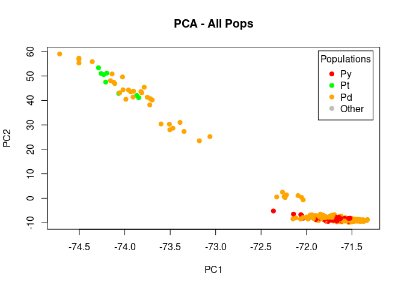<!-- -->

``` r
# 3D Plot: Use the first three principal components (PC1, PC2, PC3)
s3d <- scatterplot3d(pca_result$li[, 1:3],
                     color = pop_colors,
                     pch = 19,
                     xlab = "PC1",
                     ylab = "PC2",
                     zlab = "PC3",
                     main = "PCA - all pops")

# Add a legend to the plot (using base R legend, placed on the current device)
legend("topright",
       legend = names(group_colors),
       col = group_colors,
       pch = 19,
       title = "Populations",
       inset = 0.02)
```

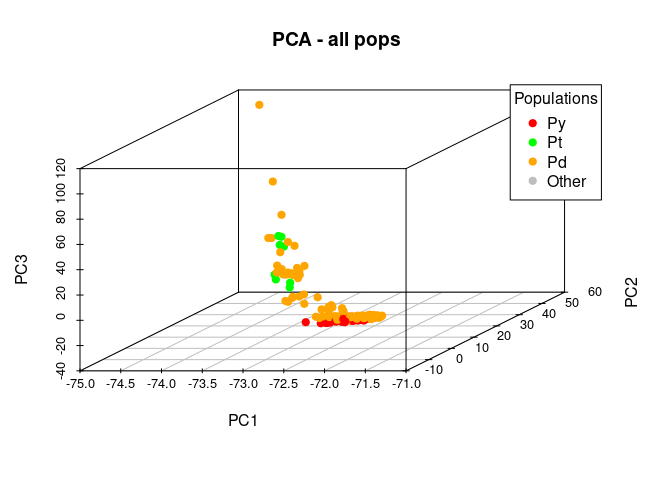<!-- -->

``` r
# Which 17 pops should be included?
```

# Repeat with my best guess of what 17 pops are the hybrid cline populations.

ZXPd02 ZXPd03 ZXPd04 XCPd03 DQPd02 MKPd04

All Py

``` r
unique(pop_codes[pop_group == "Py"])
```

    ##  [1] "BCPy03" "BSPy02" "GSPy04" "JLPy02" "LJPy02" "TCPy01" "WSPy01" "WXPy01"
    ##  [9] "ZDPy06" "ZDPy07"

``` r
genind_sub <- genind_obj[genind_obj@pop %in% c("ZXPd02", "ZXPd03", "ZXPd04", "XCPd03", "DQPd02", "MKPd04", "BCPy03", "BSPy02", "GSPy04", "JLPy02", "LJPy02", "TCPy01", "WSPy01", "WXPy01", "ZDPy06", "ZDPy07"),]
                                               
# c("JLPy02", "LJPy02", "LTPd01", "MYPd01", "MZPd02", "NYPd10", "PLPd04", "PLPd05", "PLPd06", "TCPy01", "WSPy01", "WXPy01", "XCPd03", "YLPd04", "ZDPy06", "ZDPy07", "ZXPd02"),]


# Extract population codes 
pop_codes <- as.character(pop(genind_sub))

# Group by "Py", "Ps", "Pt", or "Pd"
pop_group <- ifelse(grepl("Py", pop_codes), "Py",
               ifelse(grepl("Pd", pop_codes), "Pd",
               "Other"))
# Choose colors
group_colors <- c("Py" = "red", "Pd" = "orange", "Other" = "gray")

# Index colors by groups to get in correct order
pop_colors <- group_colors[pop_group]

# Compute PCA on the subset
pca_result3 <- dudi.pca(genind_sub, cent = FALSE, scale = TRUE, scannf = FALSE, nf = 4)

# 2D Plot: PCA results with points colored by group
plot(pca_result3$li[, 1:2],
     col = pop_colors,
     pch = 19,
     xlab = "PC1",
     ylab = "PC2",
     main = "PCA - Hybrid Cline Only")

# Add a legend to the plot; adjust 'inset' if the legend gets cut off.
legend("topright",
       legend = names(group_colors),
       col = group_colors,
       pch = 19,
       title = "Populations",
       inset = 0.02)
```

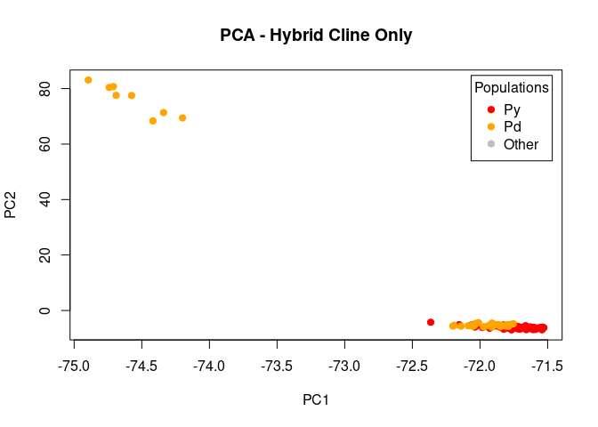<!-- -->

``` r
# 3D Plot: Use the first three principal components (PC1, PC2, PC3)
s3d <- scatterplot3d(pca_result3$li[, 1:3],
                     color = pop_colors,
                     pch = 19,
                     xlab = "PC1",
                     ylab = "PC2",
                     zlab = "PC3",
                     main = "PCA - without Ps and Pt")

# Add a legend to the plot (using base R legend, placed on the current device)
legend("topright",
       legend = names(group_colors),
       col = group_colors,
       pch = 19,
       title = "Populations",
       inset = 0.02)
```

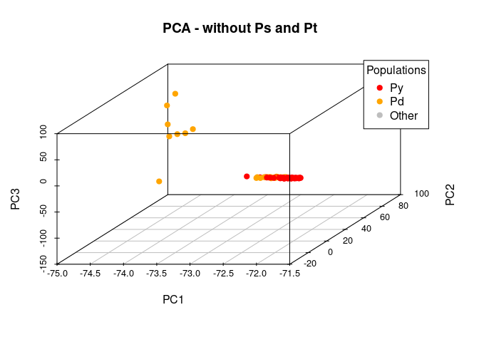<!-- -->
**Interpretation Questions for PCA Analysis:** - What patterns do you
observe in the PCA plot? - Are there distinct clusters indicating
population structure? - How does the spread of individuals relate to
hybridization?

## References

  - Nei, M. (1987). *Molecular Evolutionary Genetics*. Columbia
    University Press.
  - Guo, Y., Smith, J., & Anderson, C. (2023). *Genomic clines and
    genotype-by-environment associations*. *Evolutionary Ecology*,
    37(2), 123-135.
  - Schweizer, R. M., Saarman, N. P., Ramstad, K. M., Forester, B. R.,
    Kelley, J. L., Hand, B. K., Malison, R. L., Ackiss, A. S., Watsa,
    M., & Nelson, T. C. (2021). *Big Data in Conservation Genomics:
    Boosting Skills, Hedging Bets, and Staying Current in the Field*.
    *Journal of Heredity*, 112(4), 313–327.
    <https://doi.org/10.1093/jhered/esab019>
